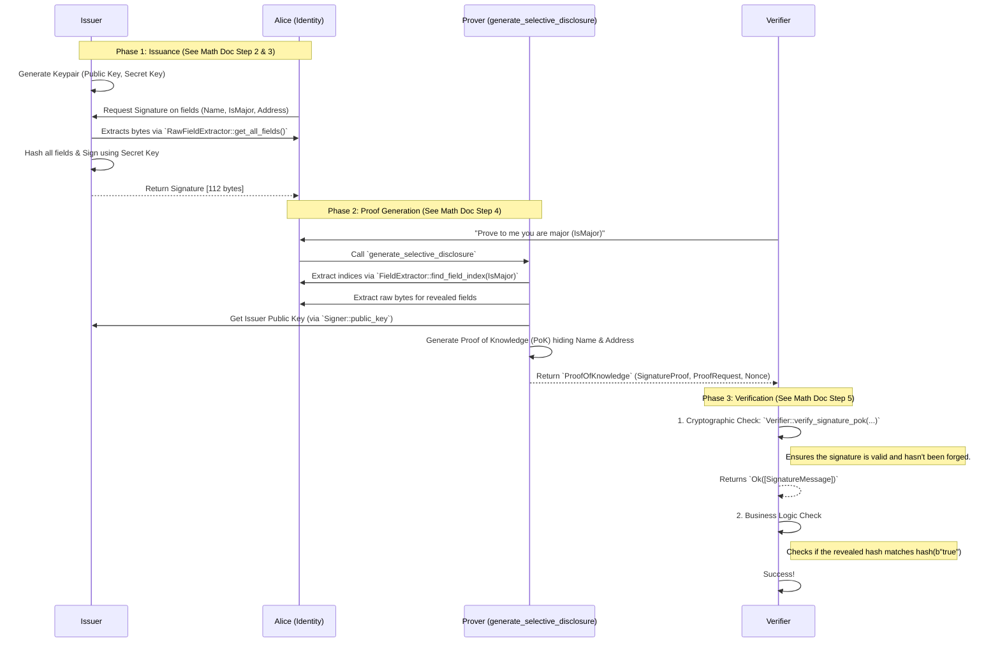

# Architecture & Flow of the BBS+ Zero-Knowledge Proof System

This poc is to understand the flow of a BBS + ZKP implementation. The goal of this system is to allow a user (Claimant/Prover) to obtain a signature on multiple attributes from a trusted authority (Issuer/Signer), and then later prove possession of that signature to a third party (Verifier) while *only* revealing a specific subset of those attributes.

## System Components

1. **Issuer (`issuer.rs`)**: Represents a trusted authority. It generates cryptographic keys and signs a user's data. It relies on the `FullExtractor` trait to extract the raw bytes of the data it needs to sign.
2. **Identity (`identity.rs`)**: Represents the user's data model. It implements `FullExtractor` to provide bytes for signing, and `FieldExtractor<IdentityField>` to map human-readable fields to their exact index in the data structure.
3. **Prover (`prover.rs`)**: Represents the client-side logic. It takes the user's full identity and signature, and selectively discloses only the requested fields to generate a zero-knowledge Proof of Knowledge (PoK).
4. **Verifier (`main.rs`)**: Represents the entity requesting the proof. It validates the mathematical proof against the Issuer's public key without ever seeing the hidden fields.

## Sequence Diagram

Below is the step-by-step interaction between the different components of the system.

